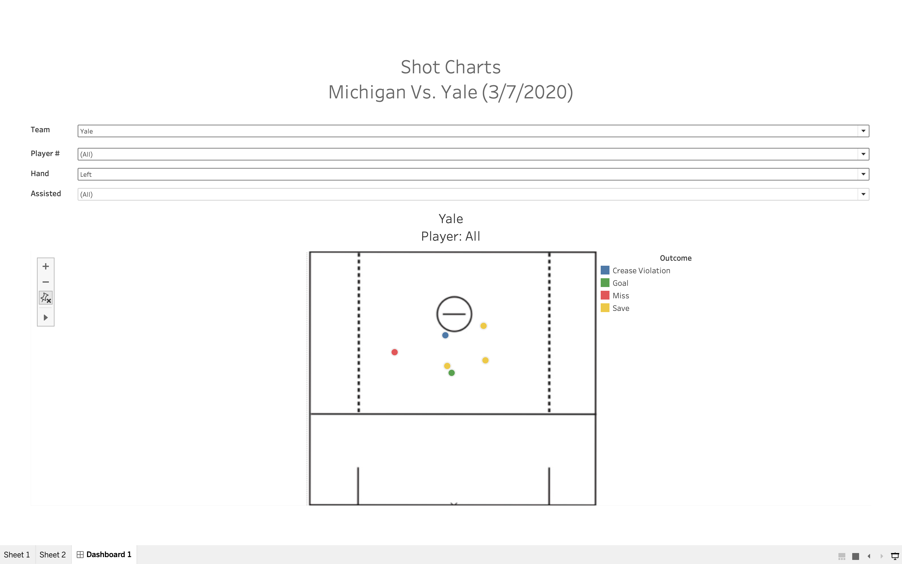
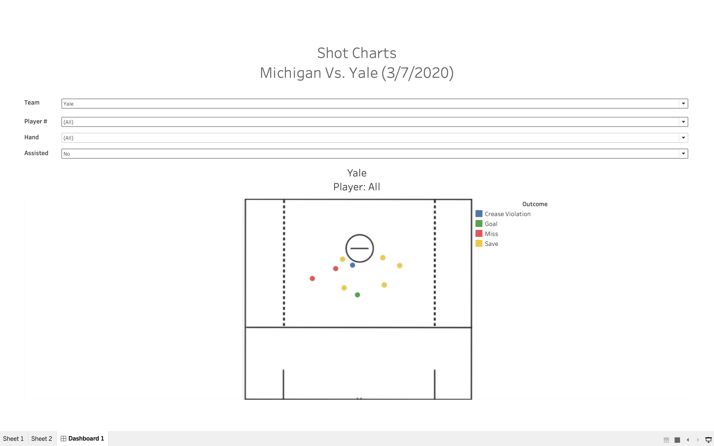
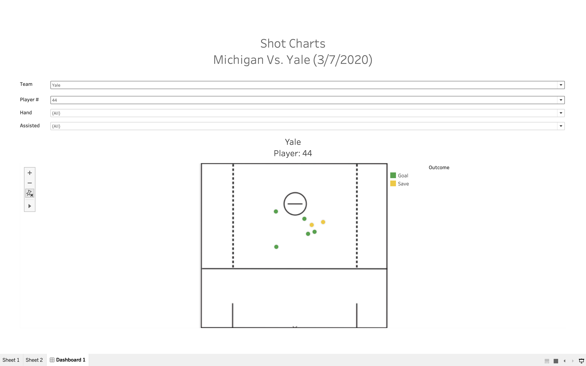
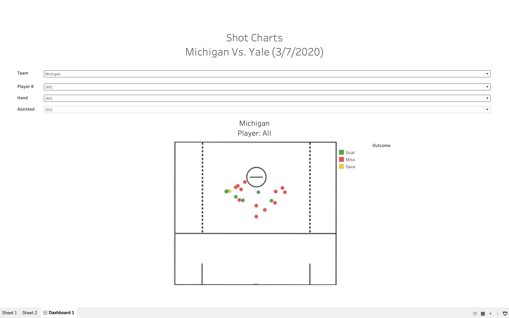

# Michigan-Vs-Yale-Shot-Maps
Shooting maps I created on Tableau for the lacrosse match between Michigan and Yale on March 3, 2020.
To interact with the charts and their filters, open ShotChartsDashboard.tbw in Tableau. The dataset used was MichiganYale.xlsx.

(All left handed shots by Yale)

(All unassisted shots by Yale)

(All shots by Yale player #44)

(All shot by Michigan)
